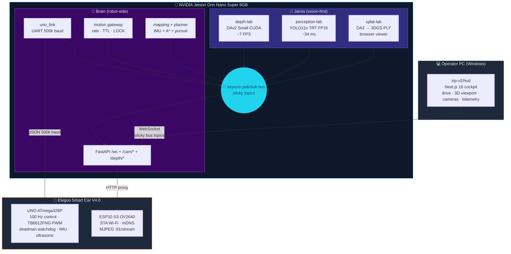
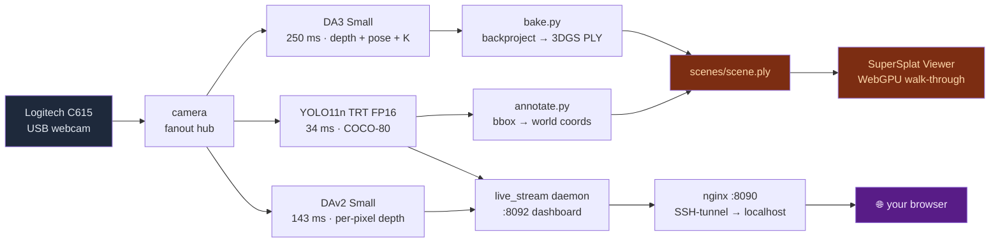
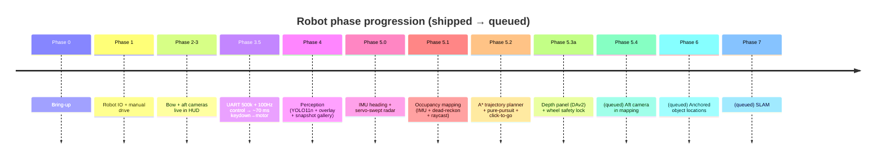

# Zip

> **A vision-first AI/robotics platform that runs locally, sees the world,
> reconstructs it in 3D, and drives a real robot — all from a $70 chassis,
> a $250 edge AI module, and the PC you already own.**

[](./LICENSE)
[](#status)
[](./docs/ROADMAP.md)
[](./jarvis/README.md)
[](./.claude/README.md)
[](./docs/adr/)

---

## Overview

Zip is a layered, edge-AI-first robotics stack that ships with sensible
safety defaults out of the box.

Vision runs on a $250 Jetson — depth, YOLO11 object detection, 3D
Gaussian-splat reconstruction. Motor control runs on a deterministic
$5 ATmega328P. The operator HUD runs in a browser. **Nothing
phones home** — everything runs locally. The architecture (UNO owns
time → Jetson owns intent → PC is a window) keeps safety provable at
the chip level and each layer independently swappable.

Start here: **[AGENTS.md](./AGENTS.md)** · **[ARCHITECTURE.md](./docs/ARCHITECTURE.md)** ·
**[ADRs](./docs/adr/)** · **[STATUS.md](./docs/STATUS.md)**

---

## System architecture



**Three immovable rules** (with ADR rationale):

1. **UNO owns time** ([ADR 0002](./docs/adr/0002-uno-owns-time.md))
   — PWM, motor ramp, deadman watchdog live on the MCU. Linux ≠
   real-time, so we don't trust it with motor pulses.
2. **UART at exactly 500000 baud** ([ADR 0003](./docs/adr/0003-uart-500k-baud.md))
   — integer UBRR at 16 MHz. Zero baud error. 460800 is a trap.
3. **Wheels locked by default on the bench**
   ([ADR 0005](./docs/adr/0005-wheels-locked-default.md)) —
   `ZIP_MOTION_LOCKED=1`, HUD badge visible at all times. Unlock
   explicitly per drive test.

---

## What's primary: **Jarvis** (vision-first agent)

A vision agent that runs whether or not the robot is around.



| Lab | Role | Status |
|---|---|---|
| [`jarvis/depth-lab/`](./jarvis/depth-lab) | Depth Anything V2 Small (CUDA, ~7 FPS sustained) | ✅ ship-ready |
| [`jarvis/perception-lab/`](./jarvis/perception-lab) | YOLO11n TRT FP16 (~34 ms inference) | ✅ ship-ready |
| [`jarvis/splat-lab/`](./jarvis/splat-lab) | DA3 → 3D Gaussian Splat → SuperSplat viewer | 🔄 **WIP: splat renders black**, [k-NN-init fix](./jarvis/splat-lab/scripts) staged |
| [`jarvis/llm/`](./jarvis/llm) | OpenClaw + local Qwen3-4B | ⏸️ installed, deferred ([ADR 0006](./docs/adr/0006-llm-on-jetson-deferred.md)) |

**Current concrete goal:** unblock the splat black-render — scp the
k-NN-init `bake.py` to the Jetson, re-run the launcher, confirm the
splat renders in the SuperSplat viewer.

---

## The robot: **Zip v2**

An Elegoo Smart Car V4.0 driven from the Next.js cockpit over Wi-Fi.

| Component | What | Path |
|---|---|---|
| **HUD** | Next.js 16 + React 19 cockpit | [`zip-v2/hud/`](./zip-v2/hud) |
| **Brain** | Python asyncio + FastAPI service | [`zip-v2/brain/`](./zip-v2/brain) (submodule → [`zip-brain`](https://github.com/steffenpharai/zip-brain)) |
| **Firmware** | ATmega328P (motors) + ESP32-S3 (camera) | [`zip-v2/firmware/`](./zip-v2/firmware) |

### Phase progression



**Current phase: 5.3a shipped.** See [`docs/ROADMAP.md`](./docs/ROADMAP.md)
and [`docs/STATUS.md`](./docs/STATUS.md) for detail.

---

## Measured performance

| Metric | Value | Notes |
|---|---|---|
| **Keydown → motor PWM latency** | **~70 ms** | After Phase 3.5 tuning |
| YOLO11n TRT FP16 inference | 34 ms | 30+ FPS headroom |
| DAv2 Small depth inference | 143 ms | 7 FPS sustained |
| DA3 Small inference (1-view) | 250 ms | 278 MB VRAM peak |
| End-to-end scan (capture → PLY) | ~38 s | Browser-viewable PLY once k-NN fix lands |
| UNO control loop cycle | 10 ms | 100 Hz, deterministic |
| Brain `/health` round-trip | < 50 ms | LAN |
| Live dashboard (RGB+depth+YOLO concurrent) | 6.7 FPS each | 16.2 W total, 4.3/7.6 GB RAM |
| Brain restart (full) | ~5 s | systemd Restart=on-failure |

Full numbers in [`docs/STATUS.md`](./docs/STATUS.md).

---

## Built for autonomous AI development

The repo is instrumented for Claude Code (or any compatible AI coding
agent) to drive end-to-end development with safety guardrails.

**Slash commands** (see [`.claude/commands/`](./.claude/commands)):

| Command | What it does |
|---|---|
| `/jetson-status` | Snapshot of services, GPU, models, wheels-locked state |
| `/deploy-brain` | Push current submodule SHA to Jetson + verify clean restart |
| `/verify-splat [scan-id]` | Deploy k-NN `bake.py`, run launcher, validate PLY |
| `/firmware-build uno\|esp32\|both` | Build + size report (stops before upload) |
| `/verify-changes` | Auto-detect diff, dispatch the right verification subagent |
| `/autonomous-dev "<goal>"` | Full plan → execute → verify → commit loop |

**Project-specific subagents** (see [`.claude/agents/`](./.claude/agents)):

- `robot-tester` — verify a motion/brain change against the live
  Jetson; reads `motion.lock_state` to enforce wheels-locked default.
- `firmware-builder` — PlatformIO builds with size reports; refuses
  to flash without confirmation.
- `splat-debugger` — diagnose the splat black-render; knows the
  WebGPU transmittance underflow story and the k-NN-init fix.
- `brain-deployer` — push submodule to Jetson, restart systemd,
  verify clean journal; refuses to bypass wheels-lock.

**Skills** (see [`.claude/skills/`](./.claude/skills)):

- `autonomous-dev` — the canonical work loop with safety gates.
- `drive-safety` — hard veto on `ZIP_MOTION_LOCKED=0` patterns +
  drive-test readiness checklist.

Full setup docs at [`.claude/README.md`](./.claude/README.md).

---

## Repository map

```
zip/
├── jarvis/                ⭐ vision-first AI on Jetson (PRIMARY)
│   ├── depth-lab/         Depth Anything V2 (shipping)
│   ├── perception-lab/    YOLO11n TRT (shipping)
│   ├── splat-lab/         DA3 → 3DGS (WIP: black-render bug)
│   └── llm/               OpenClaw + Qwen3-4B (deferred)
├── zip-v2/                the autonomous robot
│   ├── hud/               Next.js 16 cockpit (PC)
│   ├── brain/             Python service (submodule → zip-brain)
│   ├── firmware/
│   │   ├── uno/           ATmega328P motor control
│   │   └── esp32-cam/     ESP32-S3 OV2640 camera bridge
│   ├── bridge/            legacy Node.js bridge (V1→V2 reference)
│   └── docs/              robot-specific docs
├── zip-v1/                archived predecessor (predicate)
├── docs/                  umbrella docs
│   ├── ARCHITECTURE.md    system picture + ownership rules
│   ├── ROADMAP.md         phase tracking
│   ├── HARDWARE.md        BOM, pinouts, network/power topology
│   ├── KNOWN_ISSUES.md    every gotcha that bit us once
│   ├── GLOSSARY.md        terminology
│   ├── STATUS.md          what's measured + shipped
│   └── adr/               7 Architecture Decision Records
├── .claude/               autonomous-dev configuration
├── .github/               workflows + templates + CODEOWNERS
├── README.md              this file
├── AGENTS.md              orientation for AI agents
├── CONTRIBUTING.md        how to contribute
├── SECURITY.md            security policy
├── CODE_OF_CONDUCT.md     Contributor Covenant
└── CHANGELOG.md           notable milestones
```

---

## Quick start

```bash
# Clone with submodule
git clone --recurse-submodules https://github.com/steffenpharai/zip.git
cd zip

# HUD (PC)
cd zip-v2/hud
npm install
npm run dev:local            # → http://localhost:3000/v2

# Brain (Jetson — managed by systemd)
ssh zip-jetson
sudo systemctl restart zip-brain
sudo journalctl -u zip-brain -f

# UNO firmware
cd zip-v2/firmware/uno
pio run -e uno --target upload

# ESP32-S3 camera firmware
cd zip-v2/firmware/esp32-cam
cp include/secrets.example.h include/secrets.h    # add Wi-Fi creds
pio run -e esp32cam_sta --target upload
```

For a fresh Jetson cold-start, see [`zip-v2/docs/DEPLOY.md`](./zip-v2/docs/DEPLOY.md).

---

## Documentation map

| For | Read |
|---|---|
| **Engineer joining the project** | [`AGENTS.md`](./AGENTS.md) → [`docs/ARCHITECTURE.md`](./docs/ARCHITECTURE.md) → [`docs/adr/`](./docs/adr/) → [`CONTRIBUTING.md`](./CONTRIBUTING.md) |
| **Operator (running the system)** | [`README.md`](./README.md) (this) → [`zip-v2/docs/DEPLOY.md`](./zip-v2/docs/DEPLOY.md) → [`docs/KNOWN_ISSUES.md`](./docs/KNOWN_ISSUES.md) |
| **AI agent (Claude / Codex / Cursor)** | [`AGENTS.md`](./AGENTS.md) → [`.claude/README.md`](./.claude/README.md) → component `CLAUDE.md` |
| **Hardware contributor** | [`docs/HARDWARE.md`](./docs/HARDWARE.md) → [`docs/KNOWN_ISSUES.md`](./docs/KNOWN_ISSUES.md) → [`zip-v2/firmware/CLAUDE.md`](./zip-v2/firmware/CLAUDE.md) |

---

## Repository hygiene

- **No secrets in tree**, every decision tracked as an ADR, AI-agent
  affordances documented.
- **Conventional-ish commits** — see [CONTRIBUTING.md](./CONTRIBUTING.md).
- **CI** on every PR — typecheck + build (HUD), PlatformIO build (UNO
  + ESP32), markdown link check.
- **Dependabot** — npm + GitHub Actions, weekly, grouped.
- **CODEOWNERS** — safety-critical paths (motion gateway, UNO motor
  code, ADRs) flagged for explicit review.
- **GitHub Actions workflows** — see [`.github/workflows/`](./.github/workflows).

---

## Status

| Track | State |
|---|---|
| **Robot mainline** | ✅ Drive · telemetry · perception · mapping · planner · depth · safety lock |
| **Jarvis vision labs** | ✅ depth-lab · perception-lab · live dashboard |
| **Jarvis splat-lab** | 🔄 Black-render bug; k-NN-init fix unverified |
| **Jarvis LLM** | ⏸️ Deferred; hybrid PC-brain architecture queued ([ADR 0006](./docs/adr/0006-llm-on-jetson-deferred.md)) |
| **Documentation** | ✅ Umbrella docs, ADRs, per-component CLAUDE.md |
| **Autonomous-dev config** | ✅ Agents, slash commands, skills, permissions |
| **CI** | ✅ HUD typecheck/build, firmware build, docs link check |
| **Hardware** | 🔧 Jetson on-robot power; permanent camera mounts open |

---

## Contact

**Steffen Pharai** · pharaisteffen@gmail.com · for a live demo, schedule
via email.

---

> **Repo URL history.** `steffenpharai/Zip` (V1) →
> [`steffenpharai/zip-v1-archive`](https://github.com/steffenpharai/zip-v1-archive)
> + `v1-archive` tag (2026-06-04). `steffenpharai/zip-v2` →
> [`steffenpharai/zip`](https://github.com/steffenpharai/zip)
> (2026-06-04, canonical monorepo).
